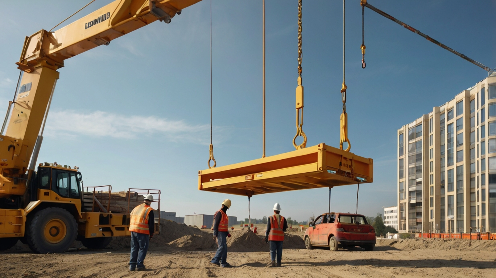
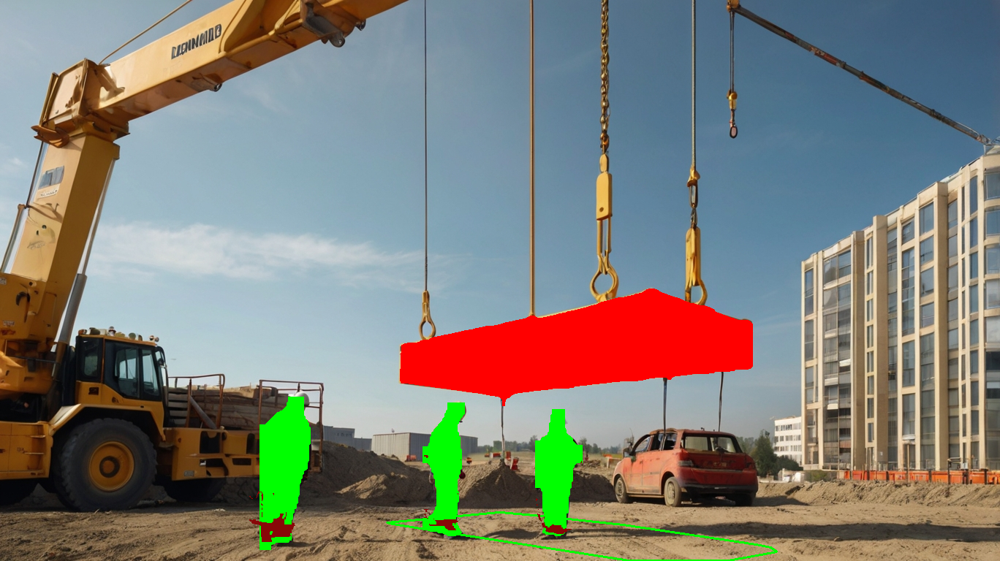

# falling-load-zone
A project to detect weather or not a person is under suspended load

This project is implemented for my 3D ComputerVision class.

# Introduction
Suspended loads carried by heavy vehicle can potentially fall and cause severe injuries to the workers. Therefore, no one should walk under a suspended load. To ensure this, I implemented a pipeline to check wether or not some one is under a suspended load.

# The Pipeline
TODO

# Installation

1. install the requirements using `pip install -r requiremnts.txt`
2. Download both [yolov8n-seg.pt](https://github.com/ultralytics/assets/releases/download/v8.1.0/yolov8n-seg.pt) and [depth_anything_v2_vits](https://huggingface.co/depth-anything/Depth-Anything-V2-Small/resolve/main/depth_anything_v2_vits.pth?download=true) and put them in `checkpoints` folder.
3. Run the code.

# Results

All of the results can be seen in `assets/outputs`.

### Example of a risky position:

Output of the pipeline:

### Example of a safe position:

.jpg "Risky Position")

Output of the pipeline:
.png "Risky Position")

# Future Works
TODO
